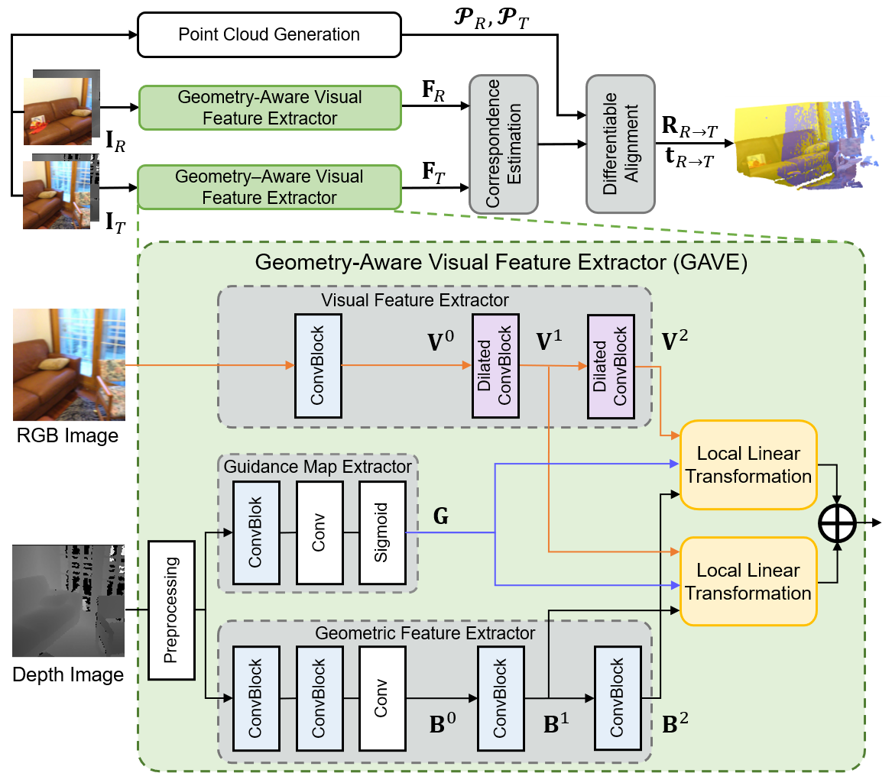
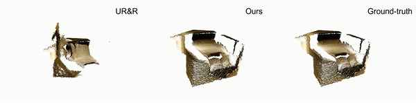

# Improving RGB-D Point Cloud Registration by Learning Multi-scale Local Linear Transformation

This repository represents the official implementation of the ECCV'2022 paper: **["Improving RGB-D Point Cloud Registration by Learning Multi-scale Local Linear Transformation"](http://arxiv.org/abs/2208.14893)** by Ziming Wang*, Xiaoliang Huo*, Zhenghao Chen, Jing Zhang, Lu Sheng† and Dong Xu (*equal contributions, †corresponding author)

<!--
This paper focus on RGB-D based feature extraction for 3D point clouds registration. If you find this project useful, please cite:
-->

## Contact
If you have any questions, please let us know:

* Ziming Wang {by1906050@buaa.edu.cn}
* Xiaoliang Huo {huoxiaoliangchn@buaa.edu.cn}

## Introduction

In this work, we propose a new Geometry-Aware Visual Feature Extractor (GAVE) that employs multi-scale local linear transformation to progressively fuse these two modalities, where the geometric features from the depth data act as the geometry-dependent convolution kernels to transform the visual features from the RGB data. The resultant visual-geometric features are in canonical feature spaces with alleviated visual dissimilarity caused by geometric changes, by which more reliable correspondence can be achieved. The proposed GAVE module can be readily plugged into recent RGB-D point cloud registration framework.



## Main Results

We train our module under two different setups: 
- Training on the 3D Match dataset for 14 epochs, and testing on the ScanNet test set.
- Training on the ScanNet dataset for 1 epoch, and testing on the ScanNet test set.

The overall results are shown in the chart below along with the checkpoints' download links:

<div align=center>
    <table>
        <tr>
            <td rowspan="3",div align="center">Train Set</td>
            <td colspan="5",div align="center">Rotation</td>   
            <td colspan="5",div align="center">Translation</td> 
            <td colspan="5",div align="center">Chamfer Distance</td>
            <td rowspan="3",div align="center">Ckpts</td>
        </tr>
        <tr>
            <td colspan="3",div align="center">accuracy</td>   
            <td colspan="2",div align="center">error</td>   
            <td colspan="3",div align="center">accuracy</td>   
            <td colspan="2",div align="center">error</td>   
            <td colspan="3",div align="center">accuracy</td>   
            <td colspan="2",div align="center">error</td>   
        </tr>
        <tr>
            <td div align="center">5°</td> 
            <td div align="center">10°</td> 
            <td div align="center">45°</td> 
            <td div align="center">Mean</td> 
            <td div align="center">Med.</td> 
            <td div align="center">5cm</td> 
            <td div align="center">10cm</td> 
            <td div align="center">25cm</td> 
            <td div align="center">Mean</td> 
            <td div align="center">Med.</td> 
            <td div align="center">1mm</td> 
            <td div align="center">5mm</td> 
            <td div align="center">10mm</td> 
            <td div align="center">Mean</td> 
            <td div align="center">Med.</td> 
        </tr>
        <tr>
            <td div align="center">3D Match</td>
            <td div align="center">93.4</td> 
            <td div align="center">96.5</td> 
            <td div align="center">98.8</td> 
            <td div align="center">3.0</td> 
            <td div align="center">0.9</td> 
            <td div align="center">76.9</td> 
            <td div align="center">90.2</td> 
            <td div align="center">96.7</td> 
            <td div align="center">6.4</td> 
            <td div align="center">2.4</td> 
            <td div align="center">86.4</td> 
            <td div align="center">95.1</td> 
            <td div align="center">96.8</td> 
            <td div align="center">5.3</td> 
            <td div align="center">0.1</td> 
            <td dic align="center"><a href="https://github.com/514DNA/LLT/blob/main/pretrained_weights/GAVE_3dmatch.pkl">ckpt</td>
        </tr>  
        <tr>
            <td div align="center">ScanNet</td>
            <td div align="center">95.5</td> 
            <td div align="center">97.6</td> 
            <td div align="center">99.1</td> 
            <td div align="center">2.5</td> 
            <td div align="center">0.8</td> 
            <td div align="center">80.4</td> 
            <td div align="center">92.2</td> 
            <td div align="center">97.6</td> 
            <td div align="center">5.5</td> 
            <td div align="center">2.2</td> 
            <td div align="center">88.9</td> 
            <td div align="center">96.4</td> 
            <td div align="center">97.6</td> 
            <td div align="center">4.6</td> 
            <td div align="center">0.1</td> 
            <td dic align="center"><a href="https://github.com/514DNA/LLT/blob/main/pretrained_weights/GAVE_scannet.pkl">ckpt</td>
        </tr>  
    </table>
</div>

Here are several visualization examples of our method comparing to our baseline and Ground Truth:

<div align=center>
    
</div>

This code has been trained/tested on:

- Python 3.6.13, PyTorch 1.7.1, CUDA 11.0.3, gcc 9.3.0, Tesla V100-PCIE-32GB

## Environment Setup

```
# create a conda environment and activate it
conda create --name GAVE python=3.10
conda activate GAVE

# install pytorch (any version that match your CUDA version)
conda install pytorch==1.12.1 torchvision==0.13.1 torchaudio==0.12.1 cudatoolkit=11.3 -c pytorch
conda install matplotlib tensorboard

# install pytorch3d
conda install pytorch3d -c pytorch3d

# install open3d
pip -m pip install open3d

# install Minkowski Engine 
git clone https://github.com/NVIDIA/MinkowskiEngine
cd MinkowskiEngine
python setup.py install --blas=openblas --blas_include_dirs=${CONDA_PREFIX}/include

# install other dependencies
python -m pip install nibabel opencv-python easydict pre-commit
```
If any error happens when installing the Minkowski Engine, please follow the [official instruction](https://github.com/NVIDIA/MinkowskiEngine#Installation).

## Datasets Setup

Following the UnsupervisedR&R, we ues two datasets for training in our work: 3DMatch and ScanNet, and evaluate only in ScanNet test set.

For the download and pre-processing procedure, please refer to [UR&R's 
instruction](https://github.com/mbanani/unsupervisedRR/blob/main/docs/datasets.md).

After downloading the datasets, make sure to update the paths in `GAVE/datasets/builder.py` with the dataaset root directories.

## Get Started

### Training
You can modify the settings of models in `GAVE/configs/config.py` and appoint the GPU in `train.py`:
```
# Training on 3DMatch dataset
python -u train.py --mode train --config_path 3DMatch.yaml
# Training on ScanNet dataset
python -u train.py --mode train --config_path ScanNet.yaml
```

### Inference
You can evaulate checkpoints using the following command:
```
python -u evaluate.py mine --checkpoint ckpt_path/ckpt_name.pkl --progress_bar --boost_alignment
```

## Acknowledgments

This repo heavily benefits from the [UnsupervisedR&R](https://github.com/mbanani/unsupervisedRR). We would like to thank Mohamed El for his excellent work.


## Citation

```
@inproceedings{wang2022improving,
  title={Improving rgb-d point cloud registration by learning multi-scale local linear transformation},
  author={Wang, Ziming and Huo, Xiaoliang and Chen, Zhenghao and Zhang, Jing and Sheng, Lu and Xu, Dong},
  booktitle={Computer Vision--ECCV 2022: 17th European Conference, Tel Aviv, Israel, October 23--27, 2022, Proceedings, Part XXXII},
  pages={175--191},
  year={2022},
  organization={Springer}
}
```